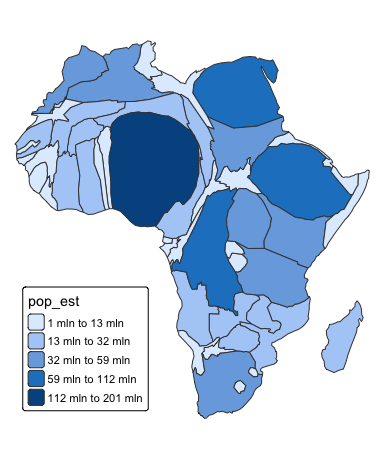
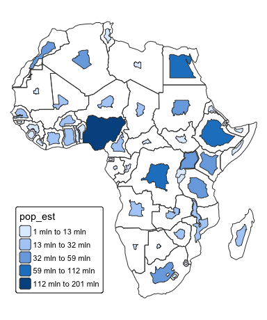
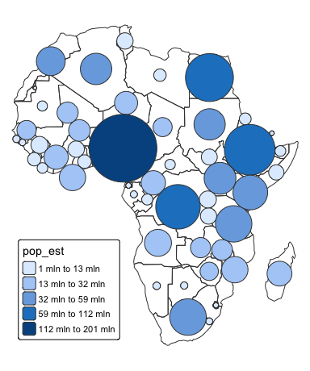

cartogram: Create Cartograms with R
================

<!-- badges: start -->

[](https://cran.r-project.org/package=cartogram)
[](https://github.com/sjewo/cartogram/actions/workflows/R-CMD-check.yaml)
[](https://cran.r-project.org/package=cartogram)
<!-- badges: end -->

`cartogram` is an R package that implements methods for generating
continuous area cartograms (based on the rubber sheet distortion
algorithm by Dougenik et al., 1985), non-contiguous area cartograms
(Olson, 1976), and non-overlapping circles cartograms (Dorling et al.,
1996).

## Installation

You can install the **cartogram** package from CRAN as follows:

``` r
install.packages("cartogram")
```

To upgrade to the latest development version of `cartogram`, install the
package `remotes` and run the following command:

``` r
remotes::install_github("sjewo/cartogram")
```

## Examples

### Continuous Area Cartogram

``` r
library(cartogram)
library(sf)
#> Linking to GEOS 3.13.0, GDAL 3.8.5, PROJ 9.5.1; sf_use_s2() is TRUE
library(tmap)

data("World")

# Keep only the African continent
afr <- World[World$continent == "Africa", ]

# Project the map
afr <- st_transform(afr, 3395)

# Construct continuous area cartogram
afr_cont <- cartogram_cont(afr, "pop_est", itermax = 5)

# Plot the cartogram
tm_shape(afr_cont) +
  tm_polygons("pop_est",
              fill.scale = tm_scale_intervals(style = "jenks")) +
  tm_layout(frame = FALSE,
            legend.position = c("left", "bottom"))
```

<!-- -->

### Non-contiguous Area Cartogram

``` r
library(cartogram)
library(sf)
library(tmap)

data("World")

# Keep only the African continent
afr <- World[World$continent == "Africa", ]

# Project the map
afr <- st_transform(afr, 3395)

# Plot the original map boundaries
tm_shape(afr) +
  tm_borders() +
  # Add the the cartogram
  tm_shape(cartogram_ncont(afr, "pop_est")) +
  tm_polygons("pop_est",
              fill.scale = tm_scale_intervals(style = "jenks")) +
  tm_layout(frame = FALSE,
            legend.position = c("left", "bottom"))
```

<!-- -->

### Non-Overlapping Circles Cartogram

``` r
library(cartogram)
library(sf)
library(tmap)

data("World")

# Keep only the African continent
afr <- World[World$continent == "Africa", ]

# Project the map
afr <- st_transform(afr, 3395)

# Plot the original map boundaries
tm_shape(afr) +
  tm_borders() +
  # Add the the cartogram
  tm_shape(cartogram_dorling(afr, "pop_est")) +
  tm_polygons("pop_est",
              fill.scale = tm_scale_intervals(style = "jenks")) +
  tm_layout(frame = FALSE,
            legend.position = c("left", "bottom"))
```

<!-- -->

## Use multiple CPU cores

``` r
library(cartogram)
library(sf)
library(tmap)
library(future)
library(future.apply)
library(parallelly)
library(progressr)

data("World")

# Keep only the African continent
afr <- World[World$continent == "Africa", ]

# Project the map
afr <- st_transform(afr, 3395)

# Create cartogram using 2 CPU cores on the local machine
# This can speed up computation for larger datasets.
# Set show_progress to TRUE for a progress indicator.
afr_cont <- cartogram_cont(afr, weight = "pop_est",
                            itermax = 5, 
                            n_cpu = 2,
                            show_progress = FALSE)

# Plot the cartogram
tm_shape(afr_cont) +
  tm_polygons("pop_est",
              fill.scale = tm_scale_intervals(style = "jenks")) +
  tm_layout(frame = FALSE,
            legend.position = c("left", "bottom"))
```

<!-- -->

## Acknowledgements

The non-contiguous area cartogram and non-overlapping circles cartogram
functionalities include major code contributions from
[@rCarto](https://github.com/rCarto) and
[@neocarto](https://github.com/neocarto).

[@nowosad](https://github.com/nowosad) contributed to the package by
transitioning it to use the `sf` package and by enhancing the
documentation, a task further supported by documentation improvements
from [@oliveroy](https://github.com/oliveroy).

The functionality to utilize multiple CPU cores was contributed by
[@e-kotov](https://github.com/e-kotov).

## References

This package implements algorithms based on the following seminal works:

- Dorling, D. (1996). Area Cartograms: Their Use and Creation. In
  Concepts and Techniques in Modern Geography (CATMOG), 59.
- Dougenik, J. A., Chrisman, N. R., & Niemeyer, D. R. (1985). An
  Algorithm To Construct Continuous Area Cartograms. In The Professional
  Geographer, 37(1), 75-81.
- Olson, J. M. (1976), Noncontiguous Area Cartograms. The Professional
  Geographer, 28: 371–380.
  [doi:10.1111/j.0033-0124.1976.00371.x](https://doi.org/10.1111/j.0033-0124.1976.00371.x)
